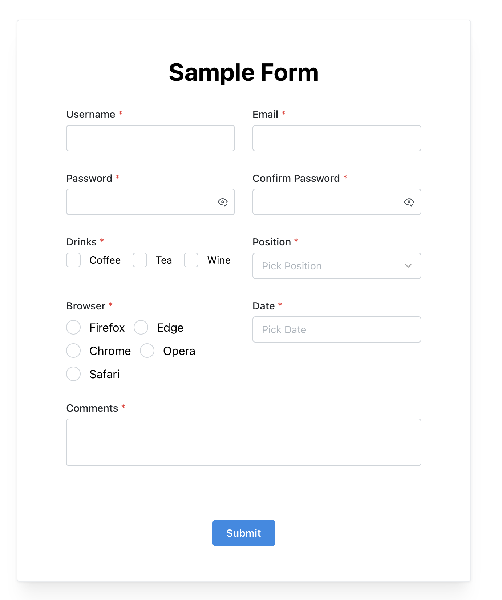

# Mantine-styled Formik Components in Typescript



## Getting Started

First, run the development server:

```bash
npm run dev
# or
yarn dev
```

Open [http://localhost:3000](http://localhost:3000) with your browser to see the result.

## Contact

If you have any questions, please contact me at rayologist1002@gmail.com